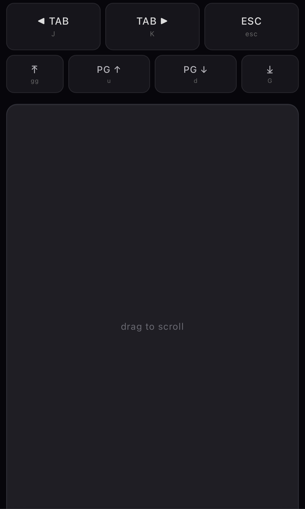

# vimium-r(emote)-c(ontroller)

Use an iPhone as a wireless scroll trackpad + Vimium remote for macOS.
Drag on the phone to scroll the active window on the laptop. Buttons
send Vimium key commands (tab switch, half-page scroll, top/bottom).


## Setup

You will need to have the [vimium chrome extension](https://github.com/philc/vimium) installed.
Play around with it using you keyboard as it intends first if you've never used [vim](https://en.wikipedia.org/wiki/Vim_(text_editor))

Phone and laptop must be on the same Wi-Fi.

```
cd phone-remote
python3 -m venv .venv
.venv/bin/pip install -e .
.venv/bin/python phone_remote.py
```

The server prints a URL like `http://192.168.1.X:8000`. Open it in
Safari on the iPhone.

On first run, macOS will prompt the terminal app for Accessibility
permission. Grant it (System Settings -> Privacy & Security ->
Accessibility) and restart the server.

## Controls

| Button     | Vimium key | Action               |
|------------|------------|----------------------|
| Drag pad   | -          | Scroll (pixel-precise) |
| TAB left   | J          | Previous tab         |
| TAB right  | K          | Next tab             |
| ESC        | esc        | Clear Vimium / focus |
| top arrow  | gg         | Scroll to top        |
| PG up      | u          | Half-page up         |
| PG down    | d          | Half-page down       |
| bot arrow  | G          | Scroll to bottom     |
| reload     | r          | Reload page          |

The button commands rely on Vimium being loaded on the active tab. They
will not work on `chrome://` pages or the new tab page.

Connection state lives on the pad itself: the border turns amber and
the hint reads "reconnecting…" while the WebSocket is down, then goes
back to normal once reconnected.

### Disclaimer 
For reasons I'm not sure of atm, the scroll trackpad sometimes does not work
Trying pressing esc and reloading the page through the reload button. 
The page up and down button can be used reliably instead if such is the case. 


## How it works

- `aiohttp` serves an HTML page with a touch pad and button grid.
- The page opens a WebSocket back to the server.
- Drag deltas are batched per animation frame and sent as
  `{type: "scroll", dy}`. The server posts macOS Quartz pixel-mode
  scroll wheel events.
- Button taps send `{type: "cmd", name}`. The server synthesizes the
  matching keystroke via `pynput`.
- Vimium handles the rest, since these keyinputs are indistinguishable 
  from regular keystrokes.

## Tuning

`SCROLL_GAIN` at the top of `phone_remote.py` controls scroll
sensitivity. Lower = finer, higher = faster.
